<!-- Animated Header Banner -->
<div align="center">
  


<!-- Animated Typing -->
<a href="https://git.io/typing-svg"></a>

<br/>

<!-- Animated Quote -->
<a href="https://git.io/typing-svg"></a>

<!-- Profile Views & Social Badges -->
<br/><br/>

&nbsp;
<a href="mailto:saichandram.sadhu.it@gmail.com"></a>
&nbsp;
<a href="https://linkedin.com/in/saichandram-sadhu-9980a2357"></a>
&nbsp;
<a href="https://github.com/saichandram-sadhu"></a>

</div>

<!-- Animated Divider -->


<!-- About Section -->
##  **About Me**


```yaml
Name: Saichandram Sadhu
Located_in: Cybersecurity Operations Center
Current_role: SOC Analyst & Threat Hunter

Mission: >
  Investigate alerts, hunt adversaries, and perform 
  forensic analysis to secure enterprise environments.

Specializations:
  - 🔍 Log Analysis & SIEM Operations
  - 🎯 Threat Hunting (MITRE ATT&CK)
  - 🛡️ Detection Engineering
  - 🔬 Digital Forensics & Incident Response
  - 🦠 Malware Analysis
  - 🤖 Security Automation

Currently_Learning:
  - Advanced Memory Forensics
  - SOAR Playbook Development
  - Cloud Security (Azure/AWS)
```

<br clear="right"/>

<!-- Skills Section with Animated Badges -->


##  **Tech Arsenal**

<div align="center">

### 🛡️ SIEM & Security Platforms


### 🔍 Forensics & Analysis


### 🎯 Threat Detection & Hunting


### 🦠 Malware Analysis


### 💻 Languages & Scripting


### 🖥️ Operating Systems


</div>

<!-- Projects Section -->


##  **Featured Projects**

<div align="center">

### 🚨 SOC & Threat Detection

</div>

<details>
<summary><b>🏠 Home SOC Lab – Elastic + Wazuh + Sysmon</b></summary>
<br/>

> *Built a complete detection lab to simulate real-world attacks and defense.*

| Component | Description |
|:---------:|:------------|
| 🏗️ **Infrastructure** | Deployed **Wazuh** for EDR and **Elastic Stack (ELK)** for log aggregation |
| 📊 **Ingestion** | Configured **Sysmon** with custom modular configuration for granular endpoint telemetry |
| ⚔️ **Simulations** | Executed attacks using **Atomic Red Team** and **Caldera** to validate log visibility |
| 🎯 **Outcome** | Successfully detected and visualized multi-stage attack chains in Kibana dashboards |

📁 **[View Lab Configuration →](./SOC-Lab/)**

</details>

<details>
<summary><b>📦 Alert Investigation Pack (5 Cases)</b></summary>
<br/>

> *End-to-end investigation of simulated security incidents.*

| # | Investigation | Key Findings |
|:-:|:--------------|:-------------|
| 1️⃣ | **Encoded PowerShell** | Decoded Base64 payloads to identify C2 beaconing attempts |
| 2️⃣ | **RDP Brute Force** | Analyzed Event ID 4625 clusters to identify attacker IP and targeted accounts |
| 3️⃣ | **Malicious Service Creation** | Detected persistence via `sc.exe` and registry run keys |
| 4️⃣ | **Persistence Mechanisms** | Investigated scheduled tasks used for maintaining access |
| 5️⃣ | **Data Exfiltration** | Identified anomalous outbound traffic patterns correlated with file access events |

📁 **[View Investigations →](./Alert-Investigations/)**

</details>

<details>
<summary><b>⚙️ Detection Engineering (20+ Rules)</b></summary>
<br/>

> *Developed and tuned detection logic to reduce noise and catch threats.*

```
📊 Results Achieved:
├── ✅ 40% reduction in false positive rates
├── ✅ Platform-agnostic Sigma rules for cross-SIEM deployment
├── ✅ Behavioral detections for LotL binaries (certutil, bitsadmin)
└── ✅ Custom rules for LSASS access and process injection
```

📁 **[View Detection Rules →](./Detections/)**

</details>

<div align="center">

### 🏹 Threat Hunting

</div>

<details>
<summary><b>🎯 MITRE ATT&CK Hypothesis-Driven Hunts</b></summary>
<br/>

> *Proactive threat hunting mapped to ATT&CK framework*

```mermaid
graph LR
    A[🔍 Hypothesis] --> B[📝 Query Development]
    B --> C[🔎 Data Analysis]
    C --> D[📋 Findings]
    D --> E[🛡️ Detection Rules]
    
    style A fill:#00ff88,stroke:#333,stroke-width:2px,color:#000
    style B fill:#00d4ff,stroke:#333,stroke-width:2px,color:#000
    style C fill:#ff6b6b,stroke:#333,stroke-width:2px,color:#000
    style D fill:#ffd93d,stroke:#333,stroke-width:2px,color:#000
    style E fill:#6bcb77,stroke:#333,stroke-width:2px,color:#000
```



| Technique | Hunt Focus | Outcome |
|:----------|:-----------|:--------|
| **T1059** | Command and Scripting Interpreter | Identified suspicious PowerShell execution patterns |
| **T1003** | OS Credential Dumping | Detected LSASS access attempts |
| **T1021** | Lateral Movement | Discovered anomalous SMB pipe connections |

📁 **[View Hunt Reports →](./Threat-Hunting/)**

</details>

<div align="center">

### 🔍 Digital Forensics & Incident Response

</div>

<details>
<summary><b>🧠 Memory Forensics</b></summary>
<br/>

> *Deep analysis of volatile memory to uncover hidden threats*

```bash
# Key Volatility 3 Plugins Used
volatility3 -f memory.raw windows.pslist      # Process enumeration
volatility3 -f memory.raw windows.netscan     # Network connections
volatility3 -f memory.raw windows.malfind     # Injected code detection
volatility3 -f memory.raw windows.cmdline     # Command line arguments
```

**🎯 Capabilities:**
- ✅ Rootkit and hidden malware identification
- ✅ Process injection detection
- ✅ Network connection reconstruction
- ✅ Credential extraction analysis

📁 **[View Memory Analysis Reports →](./Memory-Forensics/)**

</details>

<details>
<summary><b>🦠 Malware Analysis</b></summary>
<br/>

> *Comprehensive static and dynamic analysis workflow*

```
🔬 Analysis Pipeline:
│
├── 📋 Static Analysis
│   ├── PE Headers examination (PEStudio)
│   ├── String extraction and analysis
│   ├── Import/Export table review
│   └── Entropy analysis
│
├── 🔄 Dynamic Analysis
│   ├── Behavioral monitoring (ProcMon)
│   ├── Network traffic capture
│   ├── File system changes
│   └── Registry modifications
│
└── 📝 Classification
    ├── YARA rule development
    └── Malware family identification
```

📁 **[View Analysis Reports →](./Malware-Analysis/)**

</details>

<details>
<summary><b>⏱️ Forensic Timelines</b></summary>
<br/>

> *Reconstructing attack sequences through timeline analysis*

| Artifact Source | Tool | Purpose |
|:----------------|:-----|:--------|
| 📁 $MFT | Plaso | File system activity |
| 🏃 Prefetch | Eric Zimmerman's Tools | Program execution |
| 📦 Shimcache | RECmd | Application compatibility |
| 📝 Event Logs | Plaso | System events |

📁 **[View Timeline Templates →](./Disk-Forensics/)**

</details>

<div align="center">

### 🤖 AI & Network Security

</div>

<details>
<summary><b>🧠 AI-Powered Intrusion Detection System</b></summary>
<br/>

> *Machine learning-based anomaly detection for network security*

```python
# Core Technology Stack
from sklearn.ensemble import IsolationForest
import pandas as pd
import numpy as np

# Anomaly Detection Pipeline
model = IsolationForest(
    contamination=0.1,
    random_state=42,
    n_estimators=100
)
```

**✨ Features:**
- 🔍 Real-time network anomaly detection
- 📊 Web dashboard for threat visualization
- 🎯 Configurable alert thresholds
- 📈 Historical trend analysis

📁 **[View AI-IDS Project →](./AI-IDS/)**

</details>

<details>
<summary><b>🕸️ Botnet Detection</b></summary>
<br/>

> *Network traffic analysis for C2 communication identification*

**🎯 Detection Capabilities:**
- ✅ C2 beaconing pattern recognition
- ✅ IoT botnet behavioral analysis
- ✅ DGA domain identification
- ✅ Traffic flow anomaly detection

📁 **[View Botnet Analysis →](./Botnet-Detection/)**

</details>

<!-- Repository Structure -->


##  **Repository Structure**

```
📂 soc-threat-hunting-dfir-portfolio/
│
├── 🛡️ SOC-Lab/                    # Home lab configurations
│   ├── sysmon-config.xml          # Custom Sysmon configuration
│   ├── wazuh-config.md            # Wazuh deployment guide
│   └── elastic-search-queries.md  # ELK query collection
│
├── 📦 Alert-Investigations/        # Investigation case studies
│   ├── INV001_sample_investigation.md
│   ├── INV002_Credential_Theft_Report.md
│   └── investigation_template.md
│
├── ⚙️ Detections/                  # Detection rule library
│   ├── sigma_rules/               # Platform-agnostic rules
│   ├── kql_rules/                 # Microsoft Sentinel rules
│   └── splunk_rules/              # SPL detection queries
│
├── 🏹 Threat-Hunting/              # Hunt reports & templates
│   ├── HUNT_T1003_CredDump.md
│   ├── HUNT_T1021_LateralMovement.md
│   └── hunt_template.md
│
├── 🧠 Memory-Forensics/            # Volatility analysis reports
│   ├── MF_Case1_MaliciousProcess.md
│   └── volatility_commands.txt
│
├── 🦠 Malware-Analysis/            # Sample analysis reports
│   ├── MA_REPORT_TEMPLATE.md
│   └── YARA/                      # Custom YARA rules
│
├── 💾 Disk-Forensics/              # Timeline analysis
│   └── plaso_timeline_template.md
│
├── 🤖 AI-IDS/                      # ML-based detection
│   └── model_description.md
│
├── 🕸️ Botnet-Detection/            # Network analysis
│   └── flow_analysis_template.py
│
├── 🐍 scripts/                     # Automation scripts
│   ├── ioc_lookup_template.py
│   └── log_parser_template.py
│
├── 📄 templates/                   # Report templates
│   ├── hunt_report_template.md
│   ├── report_template.md
│   └── sigma_template.yml
│
└── 📚 docs/                        # Documentation
    ├── Interview_Kit.md
    ├── IR_Playbook.md
    └── Portfolio_Summary.md
```

<!-- GitHub Stats -->


##  **GitHub Analytics**

<div align="center">
  
<a href="https://github.com/saichandram-sadhu">
  
  
</a>

<br/><br/>

<!-- GitHub Streak -->


<br/><br/>

<!-- Activity Graph -->


</div>

<!-- Current Focus -->


##  **Current Focus**

<div align="center">

```
╔══════════════════════════════════════════════════════════════════╗
║                    🎯 ACTIVE LEARNING PATHS 🎯                    ║
╠══════════════════════════════════════════════════════════════════╣
║                                                                  ║
║  📈 Advanced Sysmon Configs                                      ║
║     └─ Maximum visibility with minimal noise                     ║
║                                                                  ║
║  ✍️  Signature Writing                                           ║
║     └─ Advanced Sigma and YARA rule development                  ║
║                                                                  ║
║  🕵️ Deep Forensics                                               ║
║     └─ NTFS internals and registry analysis                      ║
║                                                                  ║
║  🤖 Security Automation                                          ║
║     └─ SOAR playbooks for automated triage                       ║
║                                                                  ║
║  ☁️  Cloud Security                                               ║
║     └─ Azure & AWS security operations                           ║
║                                                                  ║
╚══════════════════════════════════════════════════════════════════╝
```

</div>

<!-- Contact Section -->


##  **Let's Connect**

<div align="center">

<a href="mailto:saichandram.sadhu.it@gmail.com">
  
</a>
&nbsp;
<a href="https://linkedin.com/in/saichandram-sadhu-9980a2357">
  
</a>
&nbsp;
<a href="https://github.com/saichandram-sadhu">
  
</a>

<br/><br/>

### 💬 Open to Opportunities

> *Actively seeking roles in SOC Analysis, Threat Hunting, and Digital Forensics.*
> 
> *Let's discuss how I can contribute to your security team!*

</div>

<!-- Quote -->
<br/>

<div align="center">
  
</div>

<!-- Footer -->
<br/>


<div align="center">
  
**⭐ Star this repository if you find it helpful!**


</div>
